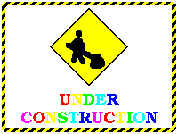

Webstrates tutorial
===================

> “No! No different. Only different in your mind. You must Unlearn what you have learned.”
> \- Grand Jedi Master Yoda

Welcome to the Webstrates tutorial. Here I will guide you through some of the basics involved in developing webstrates with Webstrates.

The principle of Webstrates is simple; Webstrates makes any webpage (called a *webstrate*) served from the Webstrates a persisted and collaborative object. That means, that any change to the Document Object Model (DOM) of a webstrate will be seen by all other clients with the same webstrate open, and will be made persistent on the server. Beside a couple of new events on DOM nodes, Webstrates introduce no new APIs. This means that it does not require learning a new API to develop with Webstrates, but rather another way of thinking.
In this tutorial I will demonstrate some of the potentials this has for making software.

The tutorial assumes that you have access to a running Webstrates server. How to set one up is described in the main [README](https://github.com/cklokmose/Webstrates) of this repository. In this tutorial I will also assume that you are using the [Chrome](https://www.google.com/chrome/) browser. I will also assume a basic familiarity with HTML, CSS and JavaScript.

  
  
1. Making a simple collaborative note
=====================================

First we will make a blank webstrate that we will call *shared\_note*. To do this point your browser to *http://\<your webstrate server\>/shared\_note*. You will now see a blank webpage.

Open the browser developer tools (*View->Developer->Developer Tools*). 
You should now see an HTML representation of the webstrate's Document Object Model (DOM).
Right-click on `<body></body>` and select '*Edit as HTML*' (From now on when I ask to edit a given HTML node I will be referring to this procedure). Now add the following HTML: `

` 

The DOM now looks as following:
  
	<html>
		<body>
			

		</body>
	</html>
	
Try to open */shared\_note* in another browser window and type some text in. The editable area will be in the top left corner of the window. The attribute `contenteditable` is what makes the content of the note DIV directly editable from the browser. Keep both of the two browser views open.

> The contenteditable attribute can be used to quickly enable collaborative text editing in Webstrates

Now lets add a bit of style to it. Edit the `<html>` tag and add `<head></head>`.

The DOM now looks as following:

	<html>
		<head>
			
		</head>
		<body>
			

		</body>
	</html>
	
Now edit the style element to get the following:

	<html>
		<head>
			
		</head>
		<body>
			

		</body>
	</html>

Your note should now be styled as a yellow sticky note. Check to see that the style has updated in your other browser view as well.

> CSS inlined in the DOM will be reinterpreted by the browser when it is edited.

2. Adding behavior
==================

Lets try to make it possible to drag the note around on the screen. Before we do thism we will just add a bit of functionality to toggle whether a note is editable or not by double-clicking it.
For that we need to add some JavaScript. Edit `<head>` and insert the following:

	

Now try to edit the note and set `contenteditable=false`. Reload the page and experiment with clicking and doubleclicking. Notice how the contenteditable attribute updates.

> You may by now have discovered that editing JavaScript and CSS directly through the developer tools of the browser is tedious at best. I have developed a simple code editor webstrate that can edit the script and style elements of another webstrate. The HTML for this editor can be found in [here](webstrates/editor.html). To use it simply create a new webstrate (e.g. */my\_editor*), edit the `<html>` element and paste in the code for the code editor. Reload the page. Type in the URL of another webstrate (e.g. */shared\_note*) and hit enter. You can now select between script and style elements using the drop down in the top. The editor relies on script and style nodes having id attributes. Note how I have added ids to all scripts and styles in the examples above. This editor relies on transclusion of webstrates which is described further below.

Now lets add the code for dragging notes around, this could look like the following:

	var edited = null; //The note currently edited
	var dragged = null; //The note currently dragged
	var offset = {x: 0, y: 0}; //Offset from mouse when dragging

	//Add event listerner for the webstrate being loaded
	document.addEventListener("loaded", function() {

		//If the user double-clicks a note then make it editable and give it focus
		document.addEventListener("dblclick", function(e) {
			var note = e.target.closest(".note");
			if (note) {
				edited = note;
				note.setAttribute("contenteditable", true);
				note.focus();
			}
		});
				
		//If the user clicks anywhere else than on the edited note disable editing
		document.addEventListener("click", function(e) {
			if (!edited || e.target.closest(".note") === edited) return;
				edited.setAttribute("contenteditable", false);
				edited = null;
		});
  
	  	//On a mouse down check if the target is a note if so store it, and its offset from the mouse
	  	document.addEventListener("mousedown", function(e) {
	      	var target = e.target.closest(".note");
	    	if (target===null) return;
	      	if (edited) return; //If we are editing we don't want to be able to drag things around
	      	dragged = target;
	      	var style = getComputedStyle(dragged);
	    	offset.x = e.clientX - parseInt(style.getPropertyValue("left"));
	      	offset.y = e.clientY - parseInt(style.getPropertyValue("top"));
	  	});
  
	  	//On a mouse move check if something is dragged, if so position it relative to the stored offset
	  	document.addEventListener("mousemove", function(e) {
	      	if (dragged === null) return;
			if (edited) return;
	      	var left = e.clientX - offset.x;
	      	var top = e.clientY - offset.y;
	      	dragged.setAttribute("style", "left: "+left+"px; top:"+top+"px;");
	  	});
  
	  	document.addEventListener("mouseup", function(e) {
	    	dragged = null;
	  	});
	});

Try to move the note around while having the webstrate open in two different browser windows.

